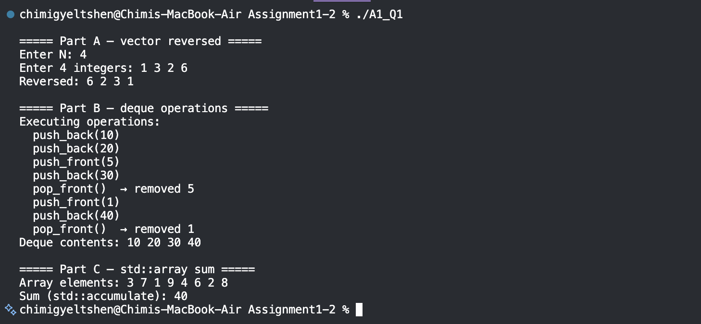
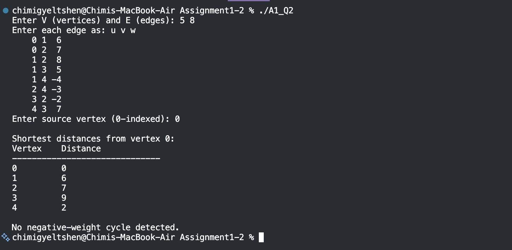
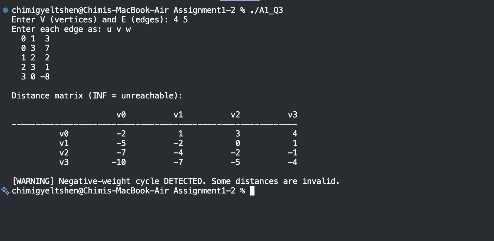
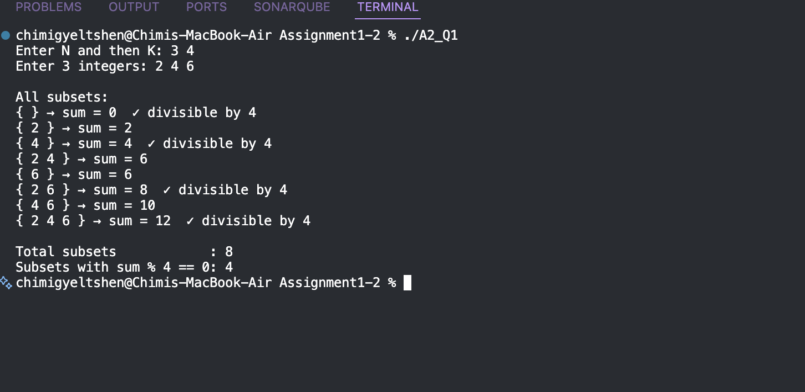
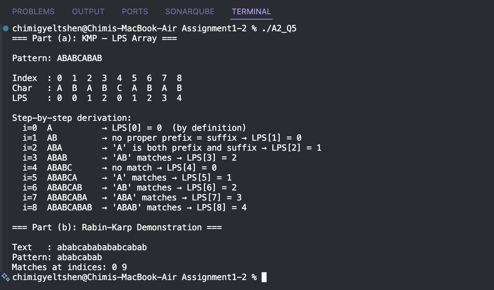

# Computative Programming Module — Assignment 1 & 2
## Table of Contents

- [Assignment 1](#assignment-1)
  - [Q1 — STL Usage](#q1--stl-usage)
  - [Q2 — Bellman-Ford Algorithm](#q2--bellman-ford-algorithm)
  - [Q3 — Floyd-Warshall Algorithm](#q3--floyd-warshall-algorithm)
- [Assignment 2](#assignment-2)
  - [Q1 — Bitmasking](#q1--bitmasking)
  - [Q2 — Johnson's Algorithm *(Theory)*](#q2--johnsons-algorithm-theory)
  - [Q3 — Arbitrage Detection *(Theory)*](#q3--arbitrage-detection-theory)
  - [Q4 — Edmonds' Algorithm *(Theory)*](#q4--edmonds-algorithm-theory)
  - [Q5 — String Matching Algorithms](#q5--string-matching-algorithms)
- [How to Compile & Run](#how-to-compile--run)
- [Learning Outcomes](#learning-outcomes)

---

## Assignment 1

### Q1 — STL Usage

**File:** `assignment1_q1_stl.cpp`  
**Topic:** Standard Template Library containers — `vector`, `deque`, `std::array`

#### What It Does

| Part | Container | Operation | STL Feature Used |
|------|-----------|-----------|------------------|
| a | `vector<int>` | Store N integers, print in reverse | `rbegin()` / `rend()` iterators, `std::copy` |
| b | `deque<int>` | Push front/back, pop front | `push_front`, `push_back`, `pop_front` |
| c | `std::array<int, 8>` | Fixed-size storage, compute sum | `std::accumulate` from `<numeric>` |

#### Key Learning
- `vector` provides dynamic contiguous storage; reverse iteration with `rbegin()`/`rend()` avoids copying the array.
- `deque` (double-ended queue) allows O(1) insert/remove at **both** ends, unlike `vector`.
- `std::array` has **compile-time** fixed size, zero overhead compared to raw C arrays, and is fully compatible with STL algorithms.
- `std::accumulate` is the idiomatic STL way to fold/reduce a range — avoids manual loops.

#### Output Screenshot


> 

---

### Q2 — Bellman-Ford Algorithm

**File:** `assignment1_q2_bellman_ford.cpp`  
**Topic:** Single-source shortest paths on directed weighted graphs (negative weights allowed)

#### What It Does
- Reads a directed graph with V vertices and E edges (weights may be negative).
- Computes shortest distances from a user-specified source vertex.
- Detects negative-weight cycles and marks affected vertices as `-INF`.

#### Algorithm Overview

```
1. Initialise dist[src] = 0, all others = INF
2. Repeat (V - 1) times:
     For every edge (u, v, w):
       if dist[u] + w < dist[v]:  relax dist[v]
3. Run V more relaxation passes:
     If dist[v] can still decrease → negative cycle found → set dist[v] = -INF
```

#### Complexity

| | Value |
|-|-------|
| **Time** | O(V × E) |
| **Space** | O(V + E) |

#### Negative Cycle Detection
After V−1 relaxation passes, any edge that can still be relaxed must be part of (or reachable from) a negative-weight cycle. The algorithm runs an additional V passes to propagate the `-INF` flag to all affected vertices.

#### Output Screenshots


> 


---

### Q3 — Floyd-Warshall Algorithm

**File:** `assignment1_q3_floyd_warshall.cpp`  
**Topic:** All-pairs shortest paths; negative cycle detection via diagonal check

#### What It Does
- Builds an initial distance matrix from user-supplied edges.
- Runs the triple-nested Floyd-Warshall DP to compute shortest paths between every pair of vertices.
- Checks `dist[i][i] < 0` to detect negative cycles.
- Prints the final formatted distance matrix.

#### Algorithm Overview

```
Initialise: dist[i][j] = edge weight if edge exists, else INF; dist[i][i] = 0

For k = 0 to V-1:          // intermediate vertex
  For i = 0 to V-1:        // source
    For j = 0 to V-1:      // destination
      dist[i][j] = min(dist[i][j], dist[i][k] + dist[k][j])

Negative cycle check:
  If dist[i][i] < 0 for any i → negative cycle exists
```

#### Complexity

| | Value |
|-|-------|
| **Time** | O(V³) |
| **Space** | O(V²) |

#### Theory: Why It Works & Why It Fails with Negative Cycles

**Why it works with negative edge weights:**  
Floyd-Warshall uses dynamic programming over intermediate vertices. The recurrence `dist[i][j] = min(dist[i][j], dist[i][k] + dist[k][j])` only adds and compares values — it never multiplies — so negative weights are handled correctly. A path with a negative edge simply produces a smaller sum, which the `min()` captures naturally.

**Why it fails in the presence of negative cycles:**  
A negative cycle allows indefinitely reducing a path's cost toward −∞. Because the algorithm runs a fixed O(V³) number of steps, it cannot represent −∞. Instead, erroneous relaxations propagate incorrect values to all vertices reachable from the cycle, making the output meaningless. The canonical check is: if `dist[i][i] < 0` after the algorithm completes, vertex `i` lies on a negative cycle.

#### Output Screenshot


> 

---

## Assignment 2

### Q1 — Bitmasking

**File:** `assignment2_q1_bitmask.cpp`  
**Topic:** Subset enumeration using bitmasks; divisibility counting

#### What It Does
- Reads a set of N integers (N ≤ 20) and an integer K.
- Generates all 2^N subsets using bitmask iteration.
- Counts and prints subsets whose element sum is divisible by K.

#### How Bitmasking Works
Each integer `mask` from `0` to `2^N - 1` represents a unique subset. If **bit j** of `mask` is set (`mask & (1 << j)`), then `arr[j]` is included in the subset. This maps every possible combination to exactly one integer.

```cpp
for (int mask = 0; mask < (1 << N); ++mask) {
    for (int j = 0; j < N; ++j) {
        if (mask & (1 << j))   // arr[j] is in this subset
            sum += arr[j];
    }
}
```

#### Complexity

| | Value |
|-|-------|
| **Time** | O(2^N × N) |
| **Space** | O(N) |
| **Max N** | 20 (2^20 ≈ 1M subsets — fast in practice) |

#### Output Screenshot


> 

---

### Q2 — Johnson's Algorithm *(Theory)*

> **Note:** This question is theory-only (no implementation required).

#### Why Johnson's Is More Efficient Than Floyd-Warshall for Sparse Graphs

Floyd-Warshall always runs in **O(V³)** time regardless of the number of edges. Johnson's Algorithm, by contrast, runs Dijkstra's algorithm once per vertex. Its total complexity is **O(V² log V + VE)**. When the graph is **sparse** (i.e., E ≪ V²), this is significantly faster than O(V³).

For example, with V = 1000 and E = 2000 (a very sparse graph):
- Floyd-Warshall: ≈ 1,000,000,000 operations
- Johnson's: ≈ 1000 × (2000 + 1000 × log 1000) ≈ 12,000,000 operations

#### Purpose of Edge Reweighting & Role of Bellman-Ford

Johnson's cannot directly apply Dijkstra (which requires non-negative weights) to graphs with negative edges. The reweighting step solves this:

1. A dummy vertex `s` is added with zero-weight edges to all other vertices.
2. **Bellman-Ford** is run from `s` to compute `h[v]` — the shortest distance from `s` to every vertex `v`. Bellman-Ford is used here (rather than Dijkstra) precisely *because* it handles negative weights.
3. Each edge weight is reweighted: `w'(u, v) = w(u, v) + h[u] − h[v]`.
4. This transformation guarantees all reweighted edges are **non-negative** while preserving relative shortest path ordering.
5. Dijkstra is then run from every vertex on the reweighted graph, and the original distances are recovered by subtracting the `h` offsets.

---

### Q3 — Arbitrage Detection *(Theory)*

> **Note:** This question is theory-only (no implementation required).

#### Modelling Currency Exchange as a Directed Graph

- **Vertices** represent currencies (e.g., USD, EUR, JPY).
- **Directed edges** represent exchange rates: an edge from currency A to currency B with weight `rate(A→B)` means 1 unit of A can be exchanged for `rate(A→B)` units of B.
- An **arbitrage opportunity** exists if there is a cycle where the product of exchange rates along the cycle is greater than 1 (i.e., you end up with more money than you started with).

#### Logarithmic Transformation

Directly detecting a product > 1 over a cycle does not map to standard shortest-path frameworks. The transformation `w(u, v) = −log(rate(u→v))` converts the problem:

- A cycle with **product > 1** becomes a cycle with **negative sum** (because −log(product > 1) < 0).
- This is now exactly the **negative cycle detection** problem in a shortest-path framework.

Mathematically:
```
rate_A→B × rate_B→C × rate_C→A > 1
⟺  log(rate_A→B) + log(rate_B→C) + log(rate_C→A) > 0
⟺  −log(rate_A→B) − log(rate_B→C) − log(rate_C→A) < 0   ← negative cycle
```

#### Algorithm Used: Bellman-Ford

**Bellman-Ford** is the appropriate algorithm because:
1. It handles negative edge weights (the log-transformed weights can be negative).
2. It explicitly detects **negative-weight cycles** — which correspond exactly to arbitrage opportunities.
3. Dijkstra cannot be used here as it requires non-negative weights and cannot detect negative cycles.

---

### Q4 — Edmonds' Algorithm *(Theory)*

> **Note:** This question is theory-only (no implementation required).

#### Problem Statement

Edmonds' Algorithm (also called the **Chu-Liu/Edmonds' algorithm**) solves the **Minimum Spanning Arborescence (MSA)** problem:

> *Given a weighted directed graph G = (V, E) and a designated root vertex r, find a minimum-weight spanning arborescence — a directed spanning tree rooted at r in which there exists exactly one directed path from r to every other vertex v ∈ V \ {r}, and the total sum of edge weights is minimised.*

#### Key Distinctions
- This is the **directed** analogue of the Minimum Spanning Tree (MST) problem.
- Undirected MST algorithms (Prim's, Kruskal's) cannot be applied because edge direction matters — selecting the minimum incoming edge for each vertex does not guarantee a valid arborescence due to potential cycles.
- Edmonds' algorithm resolves cycles by **contracting** them and re-running, until a valid arborescence is found.
- **Time complexity:** O(E × V) with basic implementation; O(E + V log V) with a Fibonacci heap.

---

### Q5 — String Matching Algorithms

**File:** `assignment2_q5_string_matching.cpp`  
**Topic:** KMP (LPS array computation) and Rabin-Karp (rolling hash)

#### Part (a): KMP — LPS Array for `"ABABCABAB"`

The **Longest Prefix Suffix (LPS)** array is the core preprocessing step of KMP. `LPS[i]` is the length of the longest proper prefix of `pattern[0..i]` that is also a suffix of `pattern[0..i]`.

```
Pattern :  A  B  A  B  C  A  B  A  B
Index   :  0  1  2  3  4  5  6  7  8
LPS     :  0  0  1  2  0  1  2  3  4
```

**Step-by-step derivation:**

| i | Substring | Longest Prefix = Suffix | LPS[i] |
|---|-----------|------------------------|--------|
| 0 | `A` | (none — by definition) | 0 |
| 1 | `AB` | no match | 0 |
| 2 | `ABA` | `"A"` | 1 |
| 3 | `ABAB` | `"AB"` | 2 |
| 4 | `ABABC` | no match | 0 |
| 5 | `ABABCA` | `"A"` | 1 |
| 6 | `ABABCAB` | `"AB"` | 2 |
| 7 | `ABABCABA` | `"ABA"` | 3 |
| 8 | `ABABCABAB` | `"ABAB"` | **4** |

**Interpretation:** `LPS[8] = 4` means `"ABAB"` is simultaneously a prefix and suffix of the full pattern. During search, when a mismatch occurs at position `i`, instead of restarting from the beginning, KMP jumps back to `LPS[i-1]`, saving redundant comparisons.

#### Part (b): Rabin-Karp Algorithm

**How hash collisions are handled:**  
Rabin-Karp uses a rolling polynomial hash. When the hash of a text window matches the pattern hash, that is a *candidate* match — not a guaranteed one. A **character-by-character verification** step is performed every time hashes agree. If the characters don't match, it is a "spurious hit" (false positive). Using a large prime modulus (e.g., 10⁹ + 9) makes collisions extremely rare in practice.

**Time Complexity:**

| Case | Complexity | Reason |
|------|-----------|--------|
| **Average** | O(N + M) | Rolling hash is O(1) per window; verification is rarely triggered |
| **Worst** | O(N × M) | Adversarial input causes every window to be a spurious hit, forcing O(M) verification each time |

#### Output Screenshot


> 

---

## How to Compile & Run

All files compile with `g++ -std=c++17` on macOS M1.

```bash
# Assignment 1
g++ -std=c++17 -O2 -o a1q1 assignment1_q1_stl.cpp          && ./a1q1
g++ -std=c++17 -O2 -o a1q2 assignment1_q2_bellman_ford.cpp  && ./a1q2
g++ -std=c++17 -O2 -o a1q3 assignment1_q3_floyd_warshall.cpp && ./a1q3

# Assignment 2
g++ -std=c++17 -O2 -o a2q1 assignment2_q1_bitmask.cpp       && ./a2q1
g++ -std=c++17 -O2 -o a2q5 assignment2_q5_string_matching.cpp && ./a2q5
```

### Sample Inputs

**Bellman-Ford (Q1-2):**
```
5 8
0 1 6
0 2 7
1 2 8
1 3 5
1 4 -4
2 4 -3
3 2 -2
4 3 7
0
```

**Floyd-Warshall (Q1-3):**
```
4 6
0 1 3
0 2 8
0 3 -4
1 3 7
2 1 4
3 2 2
```

**Bitmask (Q2-1):**
```
3 4
2 4 6
```

---

